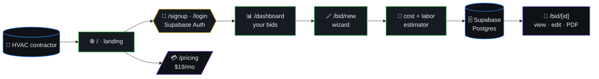
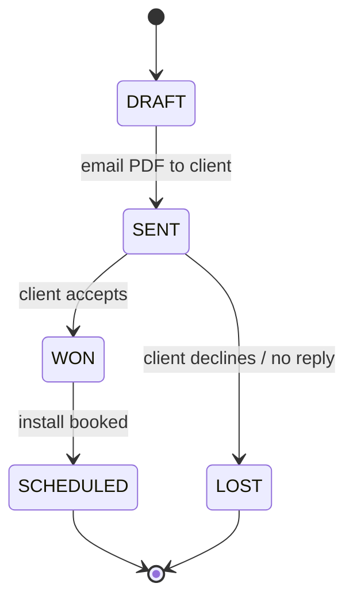

# HVAC BidPro

> AI bid calculator for HVAC contractors. Enter job details, get a
> formatted bid with material costs, labor estimates, and profit
> margins. Competitors charge $50-200/mo — we charge **$19/mo**.



## Table of contents

- [Stack](#stack)
- [Architecture](#architecture)
- [Bid build (algorithm)](#bid-build-algorithm)
- [Bid lifecycle (state)](#bid-lifecycle-state)
- [Getting Started](#getting-started)

## Bid build (algorithm)

```mermaid
flowchart LR
    A([/bid/new])
    B["collect job inputs<br/>scope · tonnage · site"]
    C["materials lookup<br/>SKU prices"]
    D["labor estimate<br/>crew × hours"]
    E["overhead %"]
    F["profit margin %"]
    G["total = mat + labor + OH + profit"]
    H["render bid PDF"]
    I["insert /bid row"]
    Z([/bid/[id]])
    A --> B --> C --> D --> E --> F --> G --> H --> I --> Z
```

## Bid lifecycle (state)



## Stack

- Next.js 16 + React 19 + Tailwind CSS 4
- Supabase (auth + database)
- Vercel deployment
- TypeScript strict mode
- Bun package manager

## Architecture

- `/` — Landing page
- `/signup`, `/login` — Auth flows (Supabase)
- `/dashboard` — User's bids/estimates
- `/bid/new` — Create new bid wizard
- `/bid/[id]` — View / edit / PDF export
- `/pricing` — Plans (Free: 3 bids/mo, Pro: $19/mo unlimited)

## Getting Started

```bash
bun install
bun run dev
```

Open [http://localhost:3000](http://localhost:3000).
